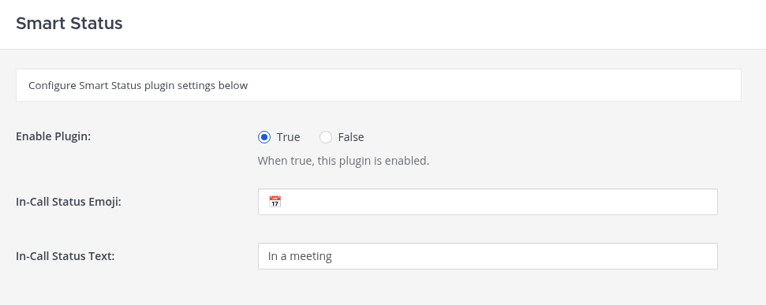

# Smart Status Plugin for Mattermost

[](https://github.com/Inocentum-Technologies/mattermost-plugin-smart-status/releases)
[](https://github.com/Inocentum-Technologies/mattermost-plugin-smart-status/actions)
[](./LICENSE)

The **Smart Status Plugin** for [Mattermost](https://mattermost.com) allows users to configure custom status messages that are automatically applied when they perform specific actions.  

The first supported trigger is **call participation**—when users join a call, their status is automatically updated. More triggers will be added in future versions.  

Admins can configure default status text and emoji for each supported action.

---

## Features

- Automatically sets a status when users join a call.  
- Customizable status **emoji** and **text**.  
- Easy to configure via the Mattermost system console.  
- Future-proof: additional smart status triggers are planned.  

---

## Screenshots

**System Console Settings**



**Smart Status in Action**


---

## Installation

1. Download the latest plugin release from the [Releases page](https://github.com/Inocentum-Technologies/mattermost-plugin-smart-status/releases).
2. In Mattermost, go to **System Console → Plugin Management**.
3. Upload the plugin `.tar.gz` file.
4. Enable the **Smart Status** plugin.

---

## Configuration

After installation, configure plugin settings in the **System Console → Plugins → Smart Status**:

- **In-Call Status Emoji**  
  Select the emoji that will be shown while the user is in a call.  

- **In-Call Status Text**  
  Set the custom status message (default: `In a meeting`).  

---

## Development

### Requirements
- [Go](https://golang.org/doc/install) `>=1.20`
- [Node.js](https://nodejs.org) `>=18`
- [Mattermost Server](https://github.com/mattermost/mattermost-server) `>=9.6.0`
- [Make](https://www.gnu.org/software/make/)

### Build the Plugin
To build both the server and webapp components into a distributable plugin package, run:

```bash
make
````

This will create a `.tar.gz` file in the `dist/` directory, which can be uploaded to your Mattermost server.

### Development Workflow

* **Server code** lives in `server/`.
* **Webapp code** lives in `webapp/`.
* Use `make` to rebuild after changes.
* For faster iteration, you can deploy the plugin directly to a local Mattermost instance (see [Mattermost developer docs](https://developers.mattermost.com/integrate/plugins/)).

---

## Support

* 📖 [Plugin Homepage](https://github.com/Inocentum-Technologies/mattermost-plugin-smart-status)
* 🐞 [Report Issues](https://github.com/Inocentum-Technologies/mattermost-plugin-smart-status/issues)

---

## License

This project is licensed under the [GPL-3.0 License](./LICENSE).

